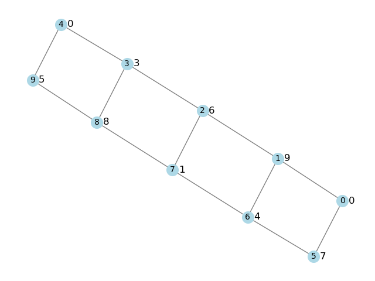

# Rotulação L(3,2,1)
Implementação de um modelo de programação inteira para o problema da Rotulação-L(3,2,1)

Dado um grafo simples $G=(V,E)$, uma **k-rotulação-L(3,2,1)** de $G$ é uma função $f\colon V \to \{1,2,\ldots, k\}$ tal que, para todo par de vértices $u,v\in V$ tem-se que $|f(u)-f(v)| \geq 4 - dist(u,v)$, onde $dist(u,v)$ denota a distância entre os vértices $u$ e $v$ no grafo $G$. O maior inteiro $k$ atribuído a um vértice pela função $f$ é chamado **span** da função $f$ e é denotado por $\lambda(f)$. Denominamos **número cromático L(3,2,1)$ de um grafo $G$ o menor span dentre todas as rotulações-L(3,2,1) de $G$ e denotamos esse número pelo símbolo $\lambda_{3,2,1}(G)$. A Figura abaixo mostra um grafo munido de uma rotulação-L(3,2,1), onde o rótulo de cada vértice é mostrado ao lado do vértice.

Neste programa, eu implemento um modelo de programação inteira que eu desenvolvi para o problema.
